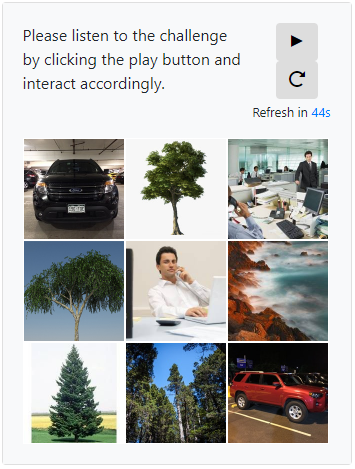

# CS6490 - Network Security Project
AuPic CAPTCHA is a new captcha that combines both audio and visual challenges. 

## Getting Started
These instructions will get you a copy of the project up and running on your local machine for demo purposes.

### Running Python web server
```
python3 -m http.server 8001
```

Now navigate to your preferred browser and enter the following URL: http://localhost:8001

Here's what you will see:



Use the Play button to play the audio challenge, then select images in the 9-box grid accordingly.

A new CAPCHA will be presented after 50 seconds of inactivity.

## Built With
* JavaScript
* [gTTS](https://pythonprogramminglanguage.com/text-to-speech/) - python library that uses Google Text to Speech (TTS) API
